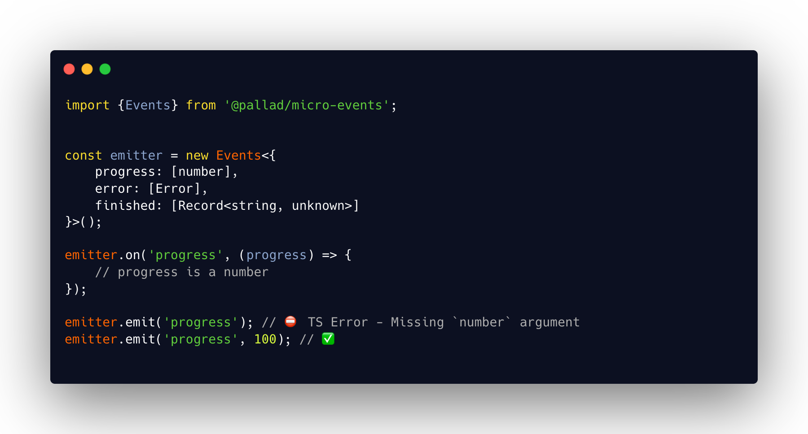

<div align="center">
<h1>micro-events ❄️</h1>

<p>Minimal, type friendly event emitter</p>
</div>

---
[](https://circleci.com/gh/pallad-ts/micro-events/tree/master)
[](https://badge.fury.io/js/@pallad%2Fmicro-events)
[](https://coveralls.io/github/pallad-ts/micro-events?branch=master)
[](https://opensource.org/licenses/MIT)
---



Minimal, type friend event emitter to prevent using events without correct types

# Community

Join our [discord server](https://discord.gg/G5tSBYbpej)

# Installation

```shell
npm install @pallad/micro-events
```

# Usage

```typescript
const events = new Events<{
	progress: [number]
}>();

// register listener on event
events.on('progress', (progress) => {
	console.log('progress', progress);
});

events.once('progress', (progress) => {
	console.log('progress once', progress);
});

events.emit('progress', 10);
events.emit('progress', 100);
// progress 10
// progress once 10
// progress 100
```

## Registering listener

```typescript
events.on('progress', (progress) => {
	console.log('progress', progress);
});

events.on('progress', () => {
	// consuming argument is not needed
});
```

## Emitting event

```typescript
events.emit('progress', 50); // notifies all registered `progress` listeners
```

## Removing listener

```typescript
const listener = () => {
	console.log('progress');
}
events.on('progress', listener);
events.off('progress', listener);

events.emit('progress', 100);

// No listeners called
```

